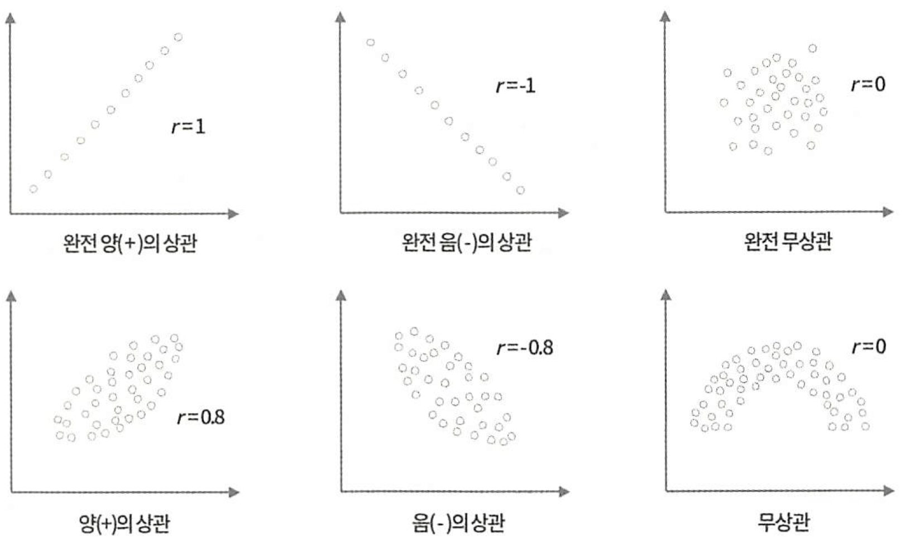

# 상관분석 개요

## #01. 공분산

2개의 확률변수의 상관정도를 나타내는 값이다.

$x$의 편차와 $y$의 편차를 곱한 것의 평균($x=y$이면 분산과 같음)

> 편차 : 실데이터 - 평균

$cov(x, y) = \frac{\sum(x_1 - \bar{x})(y_1-\bar{y})}{N-1}$

> N-1 : dof

파이썬에서는 `numpy` 패키지의 `cov()` 사용하여 공분산 값을 구할 수 있다.

### [1] 공분산 해석

#### (1) 부호

| 부호 | 설명 |
|---|---|
| `+` | 두 변수가 같은 방향으로 변화 (하나가 증가하면 다른 하나도 증가) |
| `-` | 두 변수가 반대 방향으로 변화 (하나가 증가하면 다른 하나는 감소) |

#### (2) 크기

공분산이 `0`인 경우 두 변수가 서로 독립. (한 변수의 변화로 다른 변수의 변화를 예측하지 못함)

> 두 변수간의 상관이 없다

공분산의 크기가 클 수록 두 변수는 함께 많이 변화하며 단위에 따라 공분산의 크기가 달라지므로 절대적 크기로 판단이 어려움

공분산은 선형적인 관계를 측정하기 때문에 두 변수가 비선형적으로 함께 변하는 경우는 잘 측정하지 못함

## #02. 상관분석이란?

### [1] 상관관계

두 변수 간의 관계

### [2] 상관분석

두 변수 간의 선형관계를 규명하는 통계적인 분석방법으로 상관분석은 두 변수 간의 선형관계 여부를 추론하는 가설검정이다.

두 변수의 상관관계를 알아보기 위해 상관계수(Correlation coefficient )를 사용한다.

| 가설 | 내용 |
|---|---|
| 귀무가설 ($H_0$) | 두 변수는 상관관계가 없다. ($r = 0$) |
| 대립가설 ($H_1$) | 두 변수는 상관관계가 있다. ($r \neq 0$) |

#### (1) 데이터(변량)간에 서로 관계하는 정도의 정량화

| 구분 | 방법 |
|---|---|
| 단일 변수의 산포 정도 | 분산 |
| 두 개의 변수간의 산포 정도 | 공분산 혹은 상관계수 |

> 상관계수는 정형화된 공분산으로 이해

### [3] 상관계수

공분산 값을 `-1~1` 범위로 표준화 시킨 값

상관분석을 통해 도출한 값으로 두 변수가 얼마나 관련되어 있는지, 관련성의 정도를 파악할 수 있다.

1에 가까울 수록 관련성이 크다는 의미.

양수면 정비례, 음수면 반비례 관계임을 의미.

### [4] 상관계수의 범위

| 상관 계수 범위 | 해석 |
| --- | --- |
| $0.7 < r \leqq 1$ | 강한 양 (+)의 상관이 있다 |
| $0.3 < r \leqq 0.7$ | 약한 양 (+)의 상관이 있다 |
| $0 < r \leqq 0.3$ | 거의 상관이 없다 |
| $r = 0$ | 상관관계 (선형，직선)가 존재하지 않는다 |
| $-0.3 \leqq r < 0$ | 거의 상관이 없다 |
| $-0.7 \leqq r < -0.3$ | 약한 음 (-)의 상관이 있다 |
| $-1 \leqq r < -0.7$ | 강한 음 (-)의 상관이 있다 |

### [5] 상관분석의 가설

| 가설 | 내용 | 식 |
|---|---|---|
| 귀무가설 | 두 변수는 상관이 없다 | $r = 0$ |
| 대립가설 | 두 변수는 상관이 있다 | $r \neq 0$ |

파이썬을 통해 상관분석을 수행하면 파이썬 내부적으로 t 검정통계량을 통해 얻은 p-value 값을 구할 수 있다.

이 값이 0.05 이하인 경우, 대립가설을 채택하게 되어 우리가 데이터를 통해 구한 상관계수를 활용할 수 있게 된다.

### [6] 상관분석의 가정

#### (1) 선형성

$X$가 증가할 때 $Y$도 증가하거나 감소하는 형태가 <strong>선형</strong>으로 분포해야 한다.

곡선형태로 분포할 경우 상관계수가 매우 낮거나 0의 상관을 보인다. 

이 경우 비선형분석을 시행해야 한다.

선형성이 충족될 경우 이후 진행되는 분석단계(회귀분석)가 1차 함수로 표현된다.

비선형일 경우 이후 진행되는 분석단계는 2차 이상의 함수로 표현되어야 한다.

선형성이 확보되지 않을 경우 이후 단계에서 다항회귀분석 등을 시도할 수 있겠지만, 변수 변환(로그, 제곱, 표준화 등)을 적용하여 선형으로 변환할 후 사용한다.

선형성은 산점도 그래프 시각화를 통해 파악할 수 있다.

#### (2) 등분산성(homoscedastic)

$x$와 $y$가 등분산성을 충족해야 한다.

두 변수를 대표하는 직선을 그었을 때 독립변수의 어떤 지점에서도 종속변수의 흩어진 정도가 같음을 의미

$X$가 변해감에 따라 $Y$의 흩어지는 폭이 넓어지거나 좁아지는 경향을 이분산성 (heteroscedastic) 이라하는데 이 경우 상관관계가 매우 낮게 나타난다.

> 등분산성을 충족하기 위해서는 $X$와 $Y$가 정규분포를 충족해야 한다.

## #03. 상관계수의 종류

### [1] 피어슨 상관계수

가장 대표적인 상관계수로 선형적인 상관계수를 측정한다.

공분산을 두 변수의 표준편차로 나눈 값

$p(x,y) = \frac{cov(x,y)}{\sigma_x \sigma_y}$

| 구분 | 설명 |
| --- | --- |
| 개념 | 등간척도 이상으로 측정된 두 변수들의 상관 관계 측정 방식 |
| 특징 | 연속형 변수, 정규성 가정이 충족되는 변수에 대해 사용 |
| 활용 | 연속형 vs 연속형 |

### [2] 스피어만 상관계수

| 구분 | 설명 |
| --- | --- |
| 개념 | 서열척도인 두 변수들의 상관관계 측정 방식 |
| 특징 | 순서형 변수, 비모수적 방법 **순위**를 기준으로 상관관계 측정 |
| 활용 | 연속형 vs 순서형, 순서형 vs 순서형 |

## #04. 산점도 그래프

상관계수의 정도를 좌표평면 위에 점들로 시각화 한 그래프

두 변수 간의 영향력을 보여주기 위해 가로 축과 세로 축에 데이터 포인트를 그리는 그래프.

포인터들이 오밀조밀 뭉쳐 있으면 두 변수는 서로 관련성 정도가 높고 흩어져 있으면 관련성이 낮고 분석한다.

### 1) 산점도 그래프의 의미 -> 상관 관계

#### 산점도에서 사용되는 두 변수 간의 관계

그래프에 표시되는 마커들의 배열이 직선에 가까운 경우 두 변수의 상관 관계가 높다.

마커가 산점도에 균등하게 분산되는 경우 상관 관계가 낮거나 0이다.

#### 상관관계의 유형

| 관계 | 설명 |
|---|---|
| 정의관계 | x가 증가할 때 y도 증가 (상관계수가 0보다 큼) |
| 역의관계 | x가 증가할 때 y는 감소 (상관계수가 0보다 작음) |
| 선형관계 | 직선에 가까운 배치 (상관계수가 1에 가까움) |
| 비선형관계 | 곡선에 가까운 배치 (상관계수가 1에 가깝지 않음) |

### 2) 추세선(Trend line)

시계열 데이터가 시간이 지날수록 감소 혹은 증가하는 경향이 있는지 살펴볼 수 있는 보조선.

직선(선형)의 방정식을 구하는 것

#### 추세선과 상관계수의 관계

상관계수(correlation coefficient)는 이러한 직선관계의 기울기가 양인지 아니면 음인지를 보여주고 또 관계의 정도가 얼마나 강한지 아니면 약한지 등을 보여준다.

#### 추세선의 기울기와 상관계수

추세선의 기울기: 한 변수의 증감에 따른 다른 변수의 증감($-\infin \sim +\infin$)

상관계수: 두 변수가 연관된 정도 ($-1 \sim +1$)

##### kaggle 예제

https://www.kaggle.com/code/olgaberezovsky/correlation-analysis-using-python-pandas/notebook

https://www.kaggle.com/code/sureshssarda/finding-correlation-between-variables

https://www.kaggle.com/code/vmalyi/finding-the-most-correlating-variables/notebook