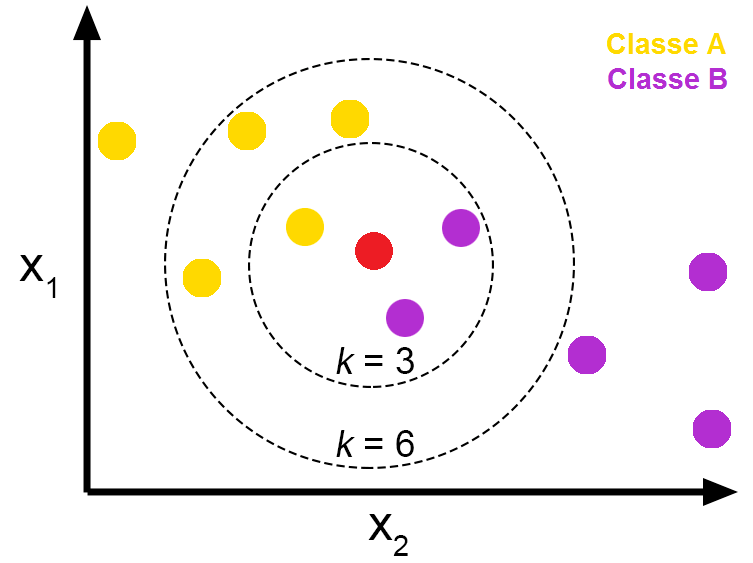

# KNN (K-Nearest neighbors, 최근접 이웃 알고리즘)

거리기반 분류 분석 모델

## #01. KNN 개요

특정 데이터로부터 거리가 가까운 $k$개의 다른 데이터의 Label을 참조하여 분류하는 알고리즘으로 새로운 데이터가 어떤 분류에 속하는지를 알고자 할 경우 사용한다.

### [1] 작동방식

```mermaid
graph LR
A{{기존의 데이터와<br/> 새로운 데이터를<br/> 비교}}-->B((새로운 데이터와<br/> 가장 인접한<br/> 데이터 k개를 선정))-->C[k개의 데이터가<br/> 가장 많이<br/> 속해있는 분류를 선택]
```
<!-- {} : 마름모, [] : 사각형, () : 끝이 둥그런 사각형, (()) : 원, {{}} : 육각형 -->

- 거리를 측정할 때 `유클리디안 거리 계산법`이나 `멘하탄 거리 계산법`을 사용
- 피타고라스의 정리와 유사

### [2] 특징

| 구분 | 내용 |
|:---:|---|
| 장점 | 정확도가 높음(실제로는...?) 오류 데이터가 결과값에 크게 영향을 미치지 않음 데이터에 대한 가정이 없음 |
| 단점 | 느림 많은 컴퓨터 메모리를 사용함 |

## #02. Sklearn의 KNeighborsClassifier

> https://scikit-learn.org/stable/modules/generated/sklearn.neighbors.KNeighborsClassifier.html

KNN 알고리즘에 따라 분류 분석을 수행하는 클래스

### [1] 주요 하이퍼 파라미터

| 파라미터 | 타입 | 설명 | 기본값 |
|:---:|:---:|---|:---:|
| n_neighbors | `int` | $k$값 | `5` |
| weights | `str` | 가중치 적용 여부 -`uniform`: 가중치 사용 안함  -`distance`: 거리의 역수 만큼 가중치 부여 | `uniform` |
| p | `int` | `1` - 맨하탄 거리 측정 `2` - 유클리디안 거리 측정 | `2` |