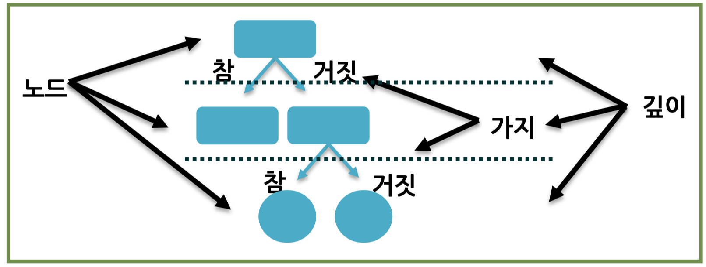

# 의사결정트리 (Decision Tree), 1986년

> 스무고개

## #01. 의사결정트리 개요

의사결정 규칙을 나무 구조로 도표화하여 일반화된 지식을 추출한다. 이를 통해 분류와 예측(회귀)을 수행한다. (회귀에서는 비추)

## #02 의사결정트리 구성

대표적으로 노드(Node), 가지(Branch), 깊이(Depth)로 구성

| 구성요소 | 이름 | 내용 |
|---|---|---|
| Root Node | 뿌리마디 | 시작점 |
| Child Node | 자식마디 | 하나 이상의 노드로부터 분리되어 나간 2개 이상의 노드들 |
| Parent Node | 부모마디 | 특정 노드의 상위 노드 |
| Terminal Node | 끝마디 | 더이상 자식을 갖지 않는 노드 |
| Internal Node | 중간마디 | 부모와 자식을 모두 갖는 노드 |
| Branch | 가지 | 뿌리마디로부터 끝마디까지 연결된 가지들 |
| Depth | 깊이 | 뿌리마디부터 끝마디까지 중간마디들의 수 |

## 03. 의사결정트리 특징

### [1] 장점

- 이해하기 쉬운 규칙이 생성된다. (`if~else`)
- 분류예측에 유용하지만 회귀예측도 가능 (범주형, 연속형 모두 가능)
- 어느 변수가 상대적으로 더 중요한지 확인 가능
- 비교적 빠른 의사결정이 가능

### [2] 단점

- 연속형 변수값을 예측(회귀)할 때 예측력이 떨어짐(적당하지 않다.)
- 트리가 복잡할 수록 예측력 저하, 해석이 어려움
- 상황에 따라 계산량이 많아서 처리속도 느림
- 안정성이 떨어짐(데이터에 약간의 변형이 있는 경우 결과가 나빠질 수 있음)

## #04. 의사결정트리 진행 절차

### [1] 프로세스

#### step1

아래와 같이 데이터를 가장 잘 구분할 수 있는 질문을 기준으로 나눈다

변수 중 하나인 $x_i$가 선택되고 $x_i$의 값중의 하나인 $s_i$(분할기준)에 의해 두 개의 부분으로 나누도록 선정 

$$x_i \Rightarrow (x_i<=s_i) ∪ (x_i>s_i)$$

#### step2

나뉜 각 범주에서 또 다시 데이터를 가장 잘 구분할 수 있는 질문을 기준으로 나눈다.

원하는 순수도에 도달할 때 까지 반복 수행

#### 주의

데이터를 나누는 작업을 지나치게 많이 하면 오버피팅이 발생한다.

결정 트리에 아무 파라미터를 주지 않고 모델링하면 오버피팅된다.

### [2] 의사결정트리 분리

| 구분 | 내용 |
|---|---|
| 반복적 분할 | 훈련용 데이터를 이용하여 독립변수의 차원공간을 반복적으로 분할 |
| 가지치기 | 평가용 데이터를 이용하여 가지치기를 수행 |
| 분할기준 | 부모마디보다 자식마디의 순수도가 증가하도록 분류를 형성 특정 범주의 개체들이 포함 되어 있는 정도 |

순수한 데이터의 비율이 높을수록 완벽한 트리가 됨

### [3] 분리기준

| 기준 | 설명 |
|---|---|
| 지니 지수 | 지니 지수를 감소시켜주는 예측변수와 그 때의 최적분리에 의해서 자식마디를 선택 |
| 엔트로피 지수 | 엔트로피 지수가 가장 작은 예측변수와 이 때의 최적분리에 의해 자식마디를 형성 |

### [4] 지니지수

> 소득이나 부의 분포를 측정하기 위해 사용되는 경제학 용어. `0`은 완전한 평등을 `1`은 완전한 불평등을 의미함.

#### (1) 지니지수의 정의

- 데이터 세트 내의 불순도(impurity) 또는 분산을 측정하는 지표
- `0`과 `1`사이의 값을 가지며, 값이 낮을수록 데이터 세트의 순도가 높음

##### 첫 번째 노드의 지니지수

$$G_i = 1 - \sum_{k=1}^{n} p_{i,k}^2$$

| 값 | 내용 |
|--|--|
| $G_i$ | $i$번째 노드의 지니지수 |
| $n$ | 클래스의 수 |
| $p_{i,k}$ | $i$번째 노드에 대해 클래스 $k$가 차지하는 비율 |

##### 분할 후의 지니지수

가중 평균을 사용하여 계산된다.

$$G_{split} = \sum_{i=1}^{m} \left( \frac{N_i}{N} \right) G_i$$

| 값 | 내용 |
|--|--|
| $G_{split}$ | 분할 후의 지니지수 |
| $m$ | 생성된 자식 노드의 수 |
| $N_i$ | $i$번째 노드에 있는 데이터 포인트의 수 |
| $N$ | 분할 전 노드에 있는 데이터 포인트의 총 수 |

#### (2) 지니지수의 의미

- 데이터 셋 내의 클래스 분포의 균일성을 나타냄
- 지니지수가 `0`에 가까울수록, 해당 노드의 데이터는 하나의 클래스로 균일하게 구성되어 있음을 의미
- 지니지수가 `1`에 가까울수록, 데이터 세트 내의 클래스 분포가 불균일하다는 것을 의미

#### (3) 의사결정나무에서의 역할

- 데이터 셋을 분할하는 기준값
- 각 가능한 분할에 대해 지니지수를 계산하고, 지니지수의 감소량이 가장 큰 분할을 선택하여 데이터 세트를 분할함
- 이때, 전체 분할 후 지니지수의 가중 평균을 최소화하는 분할이 선택됨
- 이 과정은 데이터를 가능한 한 순수한 자식 노드로 나누기 위해 반복

### [5] 엔트로피 지수

#### (1) 엔트로피의 정의

- 엔트로피는 정보 이론에서 유래한 개념으로, 데이터 세트 내의 불확실성 또는 혼잡도를 수치화한 값
- 의사결정나무에서 엔트로피는 데이터 세트 내의 클래스 간 분포의 균일성을 측정하는 데 사용됨

$$H(T) = -\sum_{i=1}^{n} p_i \log_2(p_i)$$

| 값 | 설명 |
|---|---|
| $H(T)$ | 특정 데이터 세트 $T$의 엔트로피 |
| $n$ | 클래스의 총 수 |
| $p_i$ | 데이터 셋에서 $i$번째 클래스가 등장하는 확률 |

#### (2) 엔트로피의 의미

- 엔트로피 값이 높으면 데이터 세트 내의 클래스 분포가 불균일하다는 것을 의미하며, 이는 높은 수준의 불확실성을 나타냄
- 엔트로피 값이 낮으면 클래스 분포가 균일하거나 특정 클래스가 지배적인 상태임을 나타내며, 불확실성이 낮다는 것을 의미함.

#### (3) 의사결정나무에서의 역할

- 의사결정나무 알고리즘에서 데이터 세트를 분할하는 기준으로 사용
- 각 가능한 분할에 대해 엔트로피를 계산하고, 정보이득(Information Gain)이 가장 큰 분할을 선택
    - 정보 이득(Information Gain): 분할 전후의 엔트로피 차이
- 이 과정을 각 노드에서 순도가 가장 높은 자식 노드를 생성하기 위해 반복