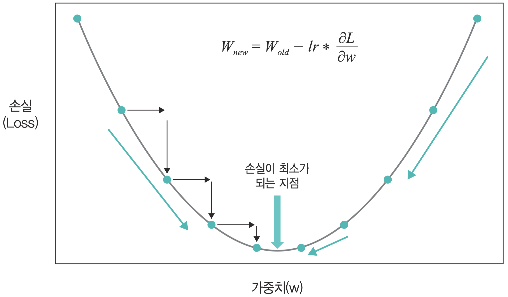

# 확률적 경사 하강법(Stochastic Gradient Decent:SGD), 2011년

손실 함수의 기울기가 최소가 되게 하는 지점을 찾아내는 경사하강법의 한 방법

## #01. 손실함수와 경사하강법

### [1] 손실함수

머신러닝, 딥러닝은 결국 컴퓨터가 독립변수로부터 종속변수에 도달하기 위한 가중치와 편향을 찾는 과정.

```python
2a + b = 3
3a + b = 7
4a + b = 9
9328742946a + b = 18,657,485,893
```

위와 같은 문제가 있을 때 컴퓨터는 a와 b를 찾기 위해 값을 직접 대입해 가면서 문제를 푼다.(노가다)

대립한 결과값과 실제 정답간의 간격(=오차, loss)을 최대한 줄이는 방향으로 값을 찾아간다.

컴퓨터가 선정한 임의의 a, b를 대입한 결과값이 실제 값에 근사하게 접근하도록 적용하는 특정 함수를 손실함수라고 한다.

머신러닝이 학습을 통해 찾아낸 a를 활용하여 구성된 회귀식이 실제 정답과의 차이가 거의 없도록 보정하기 위해 다음번에 적용할 a값을 찾기 위해 사용하는 수학 함수

### 손실함수의 종류

| 구분 | 손실함수 |
|---|---|
| 회귀분석 | MSE (평균 제곱 오차), RMSE (평균 제곱근 오차), MAE (평균 절대 오차) |
| 이항분류 | binary crossentropy (이항 교차 엔트로피) |
| 다항분류 | Categorical Crossentropy (범주형 엔트로피), Sparse Categorical Crossentropy (범주형 교차 엔트로피) |

### [2] 경사하강법

- 1차 방정식의 근삿값을 발견하기 위한 최적화 알고리즘(=수학식)
- 신경망은 가중치를 업데이트(a를 끊임없이 바꾸어 가면서 결과값을 예측)하면서 주어진 문제를 최적화한다.
- 가중치를 업데이트하는 대표적인 방법이 경사하강법 Gradient Descent이다.
- 경사하강법은 특정 함수에서의 미분을 통해 얻은 기울기를 이용하여 최적의 값을 찾아가는(손실을 줄이는) 방법이다.

#### $y = x^2$에 대한 경사하강법



- 그림 안의 수식에서 `lr(learning rate)`로 표현되고 있는 학습률을 사용하고 있다.
- 학습률은 모델의 학습에서 학습 속도나 성능에 큰 영향을 끼치는 중요한 하이퍼파라미터이다.
- 어느 지점에서 출발해도 경사를 따라가다 보면 최적값을 만날 수 있다.

### [3] Optimizer

손실을 최소화 시키면서 경사를 내려가는 방법을 결정하는 알고리즘

최적의 Gradient Descent를 적용하며 최소의 loss로 빠르고 안정적인 방법을 찾는다.


> 잘 모르겠으면 "Adam" ~!!!

## #02. 확률적 경사하강법(SGD)

각 학습마다 모든 배치가 아닌 일부 샘플을 랜덤으로 선택하여 학습에 이용한다는 것이 '확률적'의 의미임

학습 속도가 경사하강법에 비해 빠르지만 랜덤하게 선택된 데이터에 의해 노이즈가 발생할 수 있음

보통 일반적으로 말하는 SGD는 엄밀하게는 미니 배치 확률적 경사하강법을 의미함

각 학습마다 모든 배치를 학습 대상으로 사용하지 않고 랜덤으로 선택된 n개의 배치를 학습에 이용하여 그 평균 경사를 구함

