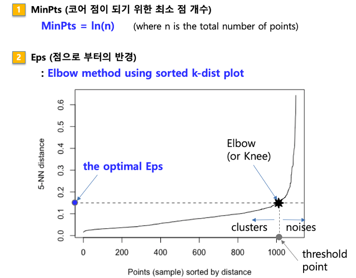

# DBSCAN 클러스터링

## #01. DBSCAN 클러스터링 개요

### [1] DBSCAN이란?

- Density-Based Spatial Clustering of Applications with Noise의 약어
- k평균 클러스터링과 같이 데이터의 위치 정보 이용
- 데이터의 밀도를 활용하여 클러스터링
    - k평균 클러스터링은 평균과의 거리가 얼마나 떨어졌는지 결정
    - DBSCAN에서는 같은 클러스터 내의 데이터들은 밀도가 높을 것이라고 가정
- 파라미터들을 활용하여 클러스터링하거나 노이즈를 제거하는 알고리즘

#### 행정 구역을 나누는 기준

1. 지역의 크기 기준
2. 사람들이 살고 있는 인구 밀도 기준

    DBSCAN은 인구 밀도를 기준으로 나누는 것이 가까움

### [2] DBSCAN 파라미터 정의

#### (1) 주변 공간에 대한 정의

- 각 데이터 벡터들로부터의 반경 $E$ (`eps`)
- 클러스터로 인정하기 위한 반경 $E$ 이내의 최소 개수 $N$ (`MinPts`)

#### (2) 그 주변 공간에 몇 개의 데이터가 존재해야 클러스터로 설정할 것인가?

- 2개의 파라미터를 활용하여 다양한 개념을 정의함
    - 이웃 벡터, 핵심 벡터, 직접 접근 가능, 접근 가능, 연결된, 클러스터, 노이즈

### [3] DBSCAN의 벡터 구분

| 분류 | 설명 |
|---|---|
| 핵심벡터 | - DBSCAN에서 각 클러스터의 중심 벡터 개녕 <br/>- 한 데이터 벡터로부터 거리 $E$ 내에 위치한 다른 데이터 백터들의 수가 $N$보다 클 경우 클러스터링 함<br/>- 이 때 중심이 되는 벡터 |
| 외곽벡터 | - 핵심 벡터로부터 거리 $E$ 내에 위치해서 같은 클러스터로 분류<br/>- 자체로는 핵심 벡터가 아니고, 해당 클러스터의 외곽을 형성<br/>- 핵심 벡터에서 접근은 가능하지만 핵심 벡터는 아닌 벡터 |
| 노이즈벡터 | - 핵심 벡터도 아니고 외곽 벡터도 아닌 벡터<br/>- 거리 $E$ 내에 $N$개 미만의 벡터가 있음<br/>- 그 벡터들이 모두 핵심 벡터가 아님<br/>- 어떠한 클러스터에도 속하지 않음(`-1`로 분류됨) |

### [4] DBSCAN의 장점

1. 클러스터의 개수를 미리 정할 필요가 없음
2. 각각의 데이터들에 대해 밀도를 계산해서 클러스터링
3. 비선형 경계의 클러스터링 가능
4. 노이즈 데이터를 따로 분류하므로 노이즈 값이 클러스터에 영향을 주지 않음
   - 이상치에 민감하지 않다.
5. DBSCAN의 N(최소 이웃의 수) 개수 때문에 클러스터에서의 경계에서 애매하게 있는 점이 줄어듦

### [5] DBSCAN의 단점

1. 데이터를 사용하는 순서에 따라 클러스터링이 다르게 될 수 있음
    - 2개 이상의 각기 다른 군집에 핵심 벡터가 있을 경우, 이 순서에 따라 외곽 벡터가 다른 클러스터에 속할 수 있음
    - 자주 발생하는 문제는 아님
    - 발생하여도 클러스터에 큰 영향을 주는 문제가 아님
2. 거리측정 방법에 따라 고차원 데이터에서 적절한 $E$를 찾기 어려움

## #02.  DBSCAN 클러스터링의 수행절차

### [1] 핵심 벡터 선정

- P1은 거리 $E$내에 $N$개 이웃 벡터가 있는 핵심 벡터(모든 벡터에서 $E$거리안의 이웃벡터의 수를 계산한다)
- P1의 직접 접근 가능한 다른 핵심 벡터 P2 또한 같은 클러스터에 속함


### [2] 외곽 벡터 선정
- 초록색 벡터
    - 이웃 벡터는 $N$개 미만, 핵심 벡터의 이웃 벡터로 외곽 벡터


### [3]  노이즈 선정

- 회색은 이웃 벡터가 $N$개 미만, 이웃 벡터도 핵심 벡터가 아님
- 노이즈로 분류


### [4] 클러스터와 노이즈 분류

- 수행 절차에 따라 노이즈를 제거한 DBSCAN 클러스터링 완료


## #03. sorted-k-dist 그래프 (KNN 거리 그래프)

- 클러스터링에 앞서 적절한 eps (epsilon) 값을 선택하는 데 중요한 역할을 하는 그래프
- `eps`는 클러스터를 형성하는 데 사용되는 밀도 기준으로, 특정 점에서 이 거리 이내에 있는 이웃 점들이 같은 클러스터로 묶이게 된다.
- KNN 거리 그래프는 각 데이터 포인트에 대해 K번째 가장 가까운 이웃까지의 거리를 플로팅하여, eps의 적절한 값을 추정하는 데 도움을 준다.



### [1] 의미

1. 모든 데이터 포인트에 대한 K번째 가장 가까운 이웃까지의 거리를 Y축에 플로팅
2. 데이터 포인트를 X축에 정렬

데이터 세트 내의 밀도 변화를 시각화하여, 데이터 포인트들이 얼마나 밀집해 있는지를 보여준다. 이를 통해 데이터의 밀도 기반 클러스터링을 위한 eps 값을 선택할 수 있다.

### [2] 해석 방법

#### 그래프의 형태 확인

KNN 거리 그래프를 그리면 대개 급격히 상승하는 "엘보" 혹은 무릎처럼 보이는 지점이 나타난다. 

이 지점은 저밀도 지역(즉, 클러스터 외부 또는 잡음)으로의 전환을 나타내며, 이 지점의 거리 값을 eps로 선택할 수 있다.

#### 감도 분석

때때로 한 가지의 K값만 고려하기보다는 여러 K값에 대해 그래프를 그려보고 eps의 선택이 클러스터링 결과에 어떻게 영향을 미치는지 관찰하는 것이 좋다. 

이를 통해 더 안정적이고 의미 있는 클러스터링 결과를 얻을 수 있다.

#### `NearestNeighbors(n_neighbors=k)`

* `NearestNeighbors`의 n_neighbors 파라미터 : 가까운 이웃의 수(기본값=5)
* `DBSCAN`의 MinPts : 핵심 포인트가 되기 위한 이웃의 수(기본값=5)

```python
n_neighbors == MinPts
```