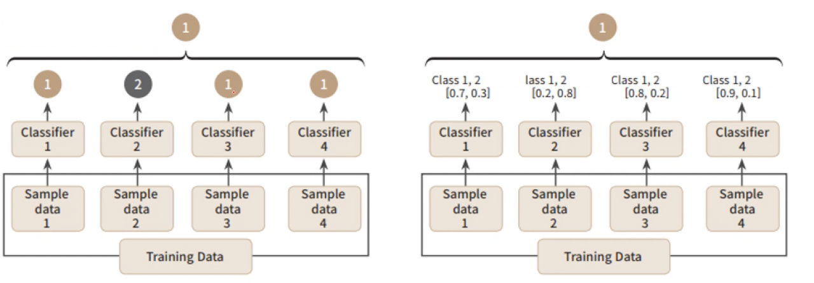

# 앙상블 학습(Ensemble Learning)

일반적으로 단일 학습모델을 사용하면 충분한 성능을 확보하기 어렵다.

이러한 부분을 보완하기 위해 여러 개의 학습모델을 생성하고 그 예측을 결합함으로써 보다 정확한 최종 예측을 도출하는 기법

보팅, 배깅, 부스팅의 기법으로 구분된다.

## #01. 보팅(Voting)

다양한 알고리즘을 사용한다. (ex: 로지스틱 + KNN)

각각의 알고리즘이 원본 데이터를 그대로 사용하여 각자 분석을 수행후 결과를 어떻게 종합하느냐에 따라 하드보팅과 소프트보팅으로 나누어 진다.

### [1] 보팅 방식 구분

#### (1) Hard Votting (왼쪽그림)

각 서브샘플에서 예측된 값을 종합하고 최빈값으로 최종 예측값을 결정함

각각의 알고리즘이 예측한 결과값에서 다수결로 결정된 값을 최종 결정값으로 정하는 방식

#### (2) Soft Votting (오른쪽 그림)

각 서브샘플에서 확률을 계산하고, 각 확률값을 통해서 최종 예측값을 결정함.

#### (3) Sklearn에서 지원하는 Voting 알고리즘

- VotingClassifier
- VotingRegressor

## #02. 배깅(Bagging)

Bootstrap Aggregation의 약자

샘플을 여러 번 뽑아(Bootstrap) 각 모델을 학습시켜 결과물을 집계(Aggregation)하는 방법

하나의 학습모델이 서로 다른 sub-sample data로 학습을 수행하는 방식

학습데이터에서 sub-sampling을 진행해서 여러 개의 하위 샘플을 생성하고, 각 샘플들에 대해서 예측을 진행하여 결과를 종합하기 때문에 과적합 가능성이 감소하고 모델의 일반화 가능성이 증가한다는 장점이 있다.

### Sklearn에서 지원하는 Bagging 알고리즘

- BaggingClassifier
- BaggingRegressor
- RandomForestClassifier
- RandomForestRegressor

## #03. 부스팅(Boosting)

**가중치**를 활용하여 약 분류기를 강 분류기로 만드는 방법.

여러 개의 분류기가 순차적으로 학습을 수행한다.

앞에서 학습한 분류기의 예측 결과에 따라 다음 분류기에 가중치가 부여된다.

처음 모델이 예측을 하면 그 예측 결과에 따라 데이터에 가중치가 부여되고, 부여된 가중치가 다음 모델에 영향을 준다. 잘못 분류된 데이터에 집중하여 새로운 분류 규칙을 만드는 단계를 반복한다.

### Sklearn에서 지원하는 Boosting 알고리즘

- AdaBoostClassifier
- AdaBoostRegressor
- GradientBoostingClassifier
- GradientBoostingRegressor

> XGBoost와 LightGBM은 sklearn에서 지원하지 않기 때문에 별도의 라이브러리를 사용

## #04. 비교

- single : 지금까지 살펴본 개별 알고리즘들
- bagging : 두 개 이상의 알고리즘이 병렬로 작동
- boosting : 순차적으로 학습하면서 한 번 학습이 끝난 후 결과에 따라 다음 학습 모델에 영향을 줄 수 있는 가중치를 부여함.

부스팅은 배깅에 비해 error가 적다. 즉, 분류 성능이 좋다.

하지만 속도가 느리고 오버피팅 가능성이 있다.