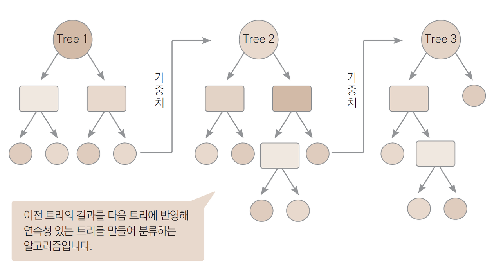

# 앙상블 학습(Ensemble Learning)

일반적으로 단일 학습모델을 사용하면 충분한 성능을 확보하기 어렵다.

이러한 부분을 보완하기 위해 여러 개의 학습모델을 생성하고 그 예측을 결합함으로써 보다 정확한 최종 예측을 도출하는 기법

보팅, 배깅, 부스팅의 기법으로 구분된다.

## #01. 보팅(Voting)

다양한 알고리즘을 사용한다. (ex: 로지스틱 + KNN)

각각의 알고리즘이 원본 데이터를 그대로 사용하여 각자 분석을 수행후 결과를 어떻게 종합하느냐에 따라 하드보팅과 소프트보팅으로 나누어 진다.

### [1] 보팅 방식 구분

#### (1) Hard Votting (왼쪽그림)

각 서브샘플에서 예측된 값을 종합하고 최빈값으로 최종 예측값을 결정함

각각의 알고리즘이 예측한 결과값에서 다수결로 결정된 값을 최종 결정값으로 정하는 방식

#### (2) Soft Votting (오른쪽 그림)

각 서브샘플에서 확률을 계산하고, 각 확률값을 통해서 최종 예측값을 결정함.

#### (3) Sklearn에서 지원하는 Voting 알고리즘

- VotingClassifier
- VotingRegressor

## #02. 배깅(Bagging)

Bootstrap Aggregation의 약자

샘플을 여러 번 뽑아(Bootstrap) 각 모델을 학습시켜 결과물을 집계(Aggregation)하는 방법

하나의 학습모델이 서로 다른 sub-sample data로 학습을 수행하는 방식

학습데이터에서 sub-sampling을 진행해서 여러 개의 하위 샘플을 생성하고, 각 샘플들에 대해서 예측을 진행하여 결과를 종합하기 때문에 과적합 가능성이 감소하고 모델의 일반화 가능성이 증가한다는 장점이 있다.

### Sklearn에서 지원하는 Bagging 알고리즘

- BaggingClassifier
- BaggingRegressor
- RandomForestClassifier
- RandomForestRegressor

#### RandomForest

의사결정트리를 사용하는 가장 대표적인 배깅 모델

의사결정트리의 단점(과적합이 자주 발생)을 보완하고 장점은 유지한다.

최근 XGBoost, LightGBM, CatBoost와 함께 주목받는 알고리즘 중 하나.

## #03. 부스팅(Boosting)

**가중치**를 활용하여 약 분류기를 강 분류기로 만드는 방법.

여러 개의 분류기가 순차적으로 학습을 수행한다.

앞에서 학습한 분류기의 예측 결과에 따라 다음 분류기에 가중치가 부여된다.

처음 모델이 예측을 하면 그 예측 결과에 따라 데이터에 가중치가 부여되고, 부여된 가중치가 다음 모델에 영향을 준다. 잘못 분류된 데이터에 집중하여 새로운 분류 규칙을 만드는 단계를 반복한다.

### [1] Adaptive Boost

초기 모형을 약한 모형으로 설정하며 매 스탭마다 가중치를 이용하여 이전 모형의 약점을 보완하는 방식으로 새로운 모형을 순차적으로 학습하고 최종적으로 이들을 선형 결합하여 얻어진 모형을 생성하는 알고리즘

> Sklearn에서 지원하는 Boosting 알고리즘

- AdaBoostClassifier
- AdaBoostRegressor

### [2] Gradient Boosting

Gradient Boosting은 여러 개의 약한 예측 모형들을 결합하여 강력한 예측 모형을 만드는 앙상블 기법 중 하나.

기본 아이디어는 앞서 학습된 모델의 오류를 줄이는 방향으로 새로운 모델을 계속 추가해 나가는 것임

모델을 순차적으로 학습시키며, 각 모델은 이전 모델의 잔차를 줄이는 방향으로 학습한다.

이때, 각 단계에서 오류를 줄이기 위해 그래디언트 하강법을 사용하여 손실 함수(loss function)의 그래디언트(경사)를 계산하고, 이를 이용해 모델을 업데이트한다.

즉, 잔차를 이용하여 이전 모형의 약점을 보완하는 새로운 모형을 순차적으로 적합한 뒤 이들을 선형 결합하여 얻어진 모형을 생성한다.

| 특징 | 내용                                                                                                                          |
| ---- | ----------------------------------------------------------------------------------------------------------------------------- |
| 장점 | 1. 구현이 쉽다 2. 정확도가 좋다. 3.유연하다(의사결정나무 이외에 다른 알고리즘 적용 가능. 여러가지 손실함수 적용 가능) |
| 단점 | 1. 과적합 발생 가능성 큼 2. 메모리 사용량이 큼 3. 해석이 어려움                                                       |

GBM은 과적합에도 강한 뛰어난 예측 성능을 가진 알고리즘이지만 
드웨어 요구사항이 다른 알고리즘에 비해 높기 때문에 메모리 소비가 크고, 수행 시간이 오래 걸린다는 단점이 있어서 실제로 잘 사용되지는 않는다.

이 알고리즘이 처음 소개되고 이를 기반으로한 많은 알고리즘이 나왔으며 최근 가장 각광 받고 있는 ML 패키지는 `XGBoost`와 `LightGBM`, `CatBoost`이다.

- GradientBoostingClassifier
- GradientBoostingRegressor

## #04. 비교

- single : 지금까지 살펴본 개별 알고리즘들
- bagging : 두 개 이상의 알고리즘이 병렬로 작동
- boosting : 순차적으로 학습하면서 한 번 학습이 끝난 후 결과에 따라 다음 학습 모델에 영향을 줄 수 있는 가중치를 부여함.

부스팅은 배깅에 비해 error가 적다. 즉, 분류 성능이 좋다.

하지만 속도가 느리고 오버피팅 가능성이 있다.

## #05. 부스팅 기반 최신 알고리즘

### [1] XGBoost (eXtreme Gradient Boosting)

결정 트리 기반의 머신러닝 알고리즘

그래디언트 부스팅의 효율성과 확장성을 대폭 향상시킴

다양한 데이터 과학 대회와 실제 응용 프로그램에서 뛰어난 성능을 발휘하여 널리 사용되고 있음

#### 특징

| 핵심 특징 | 설명 |
|----|----|
| 속도와 성능 | - XGBoost는 병렬 처리를 사용하여 매우 빠르게 실행된다. - 고급 최적화와 정규화 기법을 적용하여 다른 알고리즘에 비해 더 좋은 성능을 보인다. |
| 다양한 손실 함수 지원 | 분류, 회귀 등 다양한 종류의 손실 함수를 지원하여 광범위한 예측 문제에 적용할 수 있다. |
| 정규화와 과적합 방지 | 내장된 L1(Lasso Regression)과 L2(Ridge Regression) 정규화를 통해 과적합을 방지할 수 있다. |
| 유연성 | 사용자 정의 목적 함수와 평가 지표를 지정할 수 있어, 매우 다양한 문제에 대해 맞춤형으로 알고리즘을 구성할 수 있다. |
| 결손값 처리 | 내부적으로 결손값을 처리할 수 있어, 별도의 결손값 처리 과정 없이 모델 학습이 가능하다. | 
| 트리 가지치기 | XGBoost는 깊이 우선 탐색(DFS) 대신에 너비 우선 탐색(BFS)을 사용하여 트리를 가지치기하며, 이는 과적합을 방지하고 계산 효율성을 높인다. |
| 크로스 밸리데이션 | 내장된 교차 검증 기능을 통해 최적의 파라미터를 쉽게 찾을 수 있다. |

### [2] LightGBM

LightGBM은 Microsoft에 의해 개발된 고성능 그래디언트 부스팅(Gradient Boosting) 라이브러리

XGBoost가 하이퍼파라미터를 튜닝하면 학습시간이 매우 오래 걸리는데 이를 획기적으로 단축한 모델

XGBoost에 비해 더 빠른 학습 속도와 더 적은 메모리를 사용하며, 카테고리형 특성의 자동 변환과 최적화를 지원함

대규모 데이터 처리에 적합하며, 효율적인 멀티코어 처리를 통해 빠른 학습이 가능하다.

LightGBM은 의사 결정 트리 알고리즘을 기반으로 하며, 리프 중심 트리 분할(Leaf-wise tree growth) 방식을 사용해 다른 알고리즘에 비해 더 빠르게 학습하고, 더 나은 성능을 제공할 수 있다.

전체 성능(GPU사용)을 내기 위해서는 Install Visual Studio (2015 or newer) 환경에서 소스코드를 직접 내려받아 빌드하는 과정이 필요함.