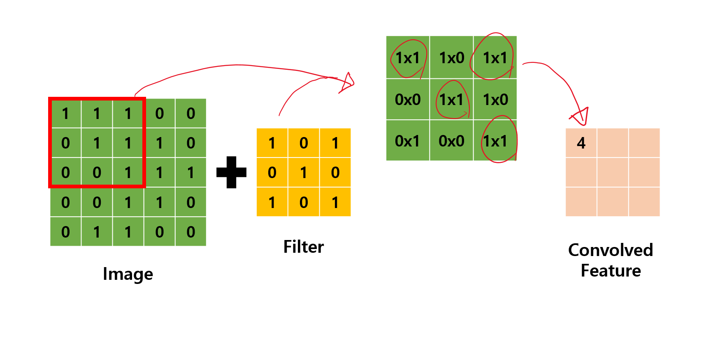
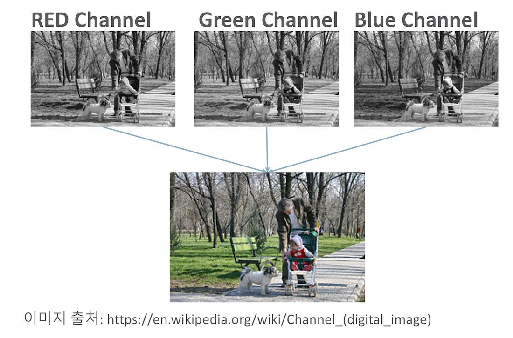
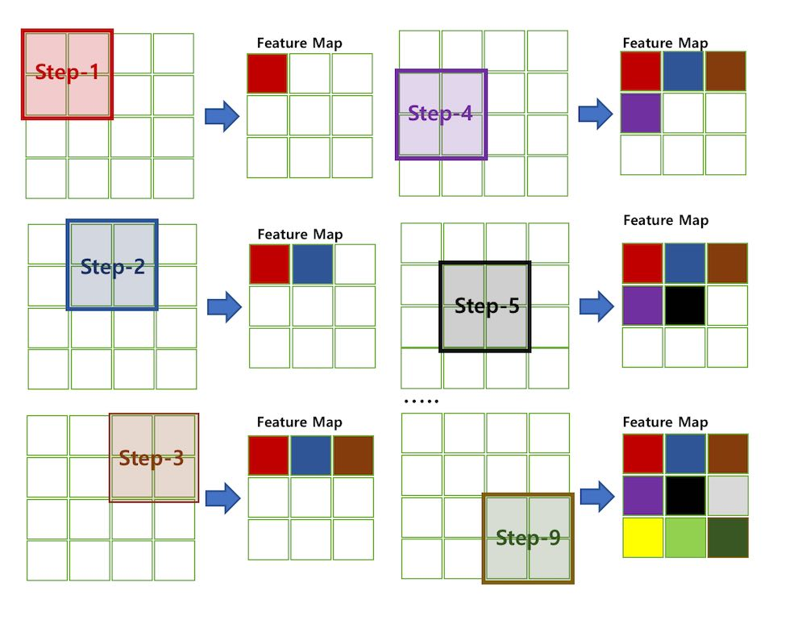
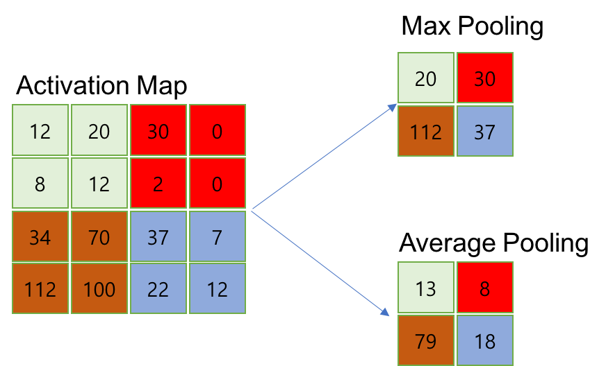

# 합성곱신경망 (CNN, Convolutional Neural Network)

## #01. CNN의 이해

이미지를 분석하는데 사용되는 딥러닝 알고리즘의 하나.

이미지를 작은 단위로 쪼개어 각 부분을 분석하는 것이 핵심

이미지를 인식하기 위한 패턴을 찾는데 유용함.

> ex) 휴대폰 잠금해제 인식, 자동차 자율주행 같은 분야

CNN은 다른 신경망과 마찬가지로 입력 계층(독립변수), 출력 계층(종속변수) 및 두 계층 사이의 여러 은닉 계층으로 구성됨. (즉, 지도학습의 일종)

## #02. CNN의 주요 개념

### [1] 합성곱(Convolutional)

#### (1) 수학적 접근

합성곱 연산은 두 함수 $f$, $g$ 가운데 하나의 함수를 반전(reverse), 전이(shift)시킨 다음, 다른 하나의 함수와 곱한 결과를 적분하는 것을 의미

#### (2) 기술적 접근

사진에 필터를 적용하여 색감을 변경하는 원리

##### 2차원 입력 데이터(Shape: (5:5))를 1개의 필터로 합성곱 연산 수행

- 이미지 파일은 2차원 배열로 이루어져 있다.
- 이미지 파일을 의미하는 2차원 배열의 각 원소는 픽셀에 표시되는 색상을 의미한다.
- 이미지 파일을 의미하는 2차원 배열의 각 원소에 일정한 값을 연산한다는 것은 색상을 일관되게 변환한다는 것을 의미

### [2] 채널(Channel)

이미지 픽셀 하나하나는 색상을 의미하는 `0~255` 사이의 실수이다.

흑백 이미지는 하나의 색상으로 명도만을 표현하면 되지만 컬러 사진은 천연색을 표현하기 위해서 각 픽셀을 RGB 3개의 실수로 표현한 3차원 데이터로 구성된다.

| 구분 | 구조 | 예시 |
|---|---|---|
| 흑백사진 | 2차원 데이터(1개 채널) | 높이가 39픽셀이고 폭이 31픽셀인 흑백 사진 데이터의 shape은 (39, 31, 1) |
| 컬러 이미지 | 3차원 데이터(RGB 3개의 채널) | 높이가 39 픽셀이고 폭이 31 픽셀인 컬러 사진 데이터의 shape은 (39, 31, 3) |

### [3] 필터(Filter)

- 이미지의 특징을 찾아내기 위한 공용 파라미터
- Kernel 이라고도 한다. (CNN에서 Filter와 Kernel은 같은 의미)
- 필터는 일반적으로 (4x4)이나 (3x3)과 같은 정사각 행렬로 정의된다.
- CNN에서 학습의 대상은 필터이다.

## #03. 합성곱 계산 절차

입력 데이터를 지정된 간격으로 순회하며 채널별로 합성곱을 하고 모든 채널(컬러의 경우 3개)의 합성곱의 합을 Feature Map로 만든다.

필터는 지정된 간격으로 이동하면서 전체 입력데이터와 합성곱하여 Feature Map을 만든다.

아래 그림은 채널이 1개인 입력 데이터를 (3x3) 크기의 필터로 합성곱하는 과정을 설명한다.

### [1] Feature Map 과정

- 필터는 입력 데이터를 지정한 간격으로 순회하면서 합성곱을 계산한다.
- 여기서 지정된 간격으로 필터를 순회하는 간격을 Stride라고 한다.
- 아래 그림은 strid가 1로 필터를 입력 데이터에 순회하는 예제.
    > strid가 2로 설정되면 필터는 2칸씩 이동하면서 합성곱을 계산한다.

### [2] 멀티 채널 입력 데이터(컬러 이미지)에 필터를 적용한 합성곱 계산 절차

입력 데이터가 여러 채널을 갖을 경우 필터는 각 채널을 순회하며 합성곱을 계산한 후, 채널별 피처 맵을 만든다.

그리고 각 채널의 피처 맵을 합산하여 최종 피처 맵으로 반환

- Feature Map은 합성곱 계산으로 만들어진 행렬이다.
- 입력 데이터는 **채널 수와 상관없이 필터 별로 1개의 피처 맵**이 만들어 진다.

### [3] Activation Map

하나의 Convolution Layer에 크기가 같은 여러 개의 필터를 적용할 수 있다. 이 경우에 Feature Map에는 필터 수 만큼의 채널이 만들어진다.

Convolution Layer의 입력 데이터를 필터가 순회하며 합성곱을 통해서 만든 Feature Map을 Activation Map이라고 한다.

Activation Map은 Feature Map 행렬에 활성 함수를 적용한 결과

즉, Convolution Layer의 최종 결과가 Activation Map

## #04. 패딩(Padding)

Filter와 Stride에 작용으로 Feature Map 크기는 입력데이터 보다 작다.

Convolution 레이어의 출력 데이터가 줄어드는 것을 방지하는 방법이 패딩

패딩은 입력 데이터의 외각에 지정된 픽셀만큼 특정 값으로 채워 넣는 것을 의미한다.

보통 패딩 값으로 0으로 채워 넣는다.

### [1] padding 예시 (2px 추가)

(32x32x3) 데이터를 외각에 2 pixel을 추가하여 (36x36x3) 행렬을 만드는 예제

Padding을 통해서 Convolution Layer의 출력 데이터의 사이즈를 조절하는 기능이 외에, 외각을 “0”값으로 둘러싸는 특징으로 부터 인공 신경망이 이미지의 외각을 인식하는 학습 효과도 있다.

## #05. Pooling Layer

Pooling Layer는 Convolution Layer의 출력 데이터(Feature Map 혹은 Activation Map)의 크기를 줄이거나 특정 데이터를 강조하는 용도로 사용된다.

Pooling Layer를 처리하는 방법으로는 Max Pooling과 Average Pooning, Min Pooling이 있다.

정사각 행렬의 특정 영역 안에 값의 최댓값을 모으거나 특정 영역의 평균을 구하는 방식으로 동작한다. 

### [1] Max Pooling, Average Pooling

Max pooling과 Average Pooling의 동작 방식은 일반적으로 Pooing 크기와 Stride를 같은 크기로 설정하여 모든 원소가 한 번씩 처리 되도록 설정하는 것이다.

### [2] Pooling 레이어 특징

- 학습대상 파라미터가 없음
- Pooling 레이어를 통과하면 행렬의 크기 감소
- Pooling 레이어를 통해서 채널 수 변경 없음

CNN에서는 주로 Max Pooling을 사용